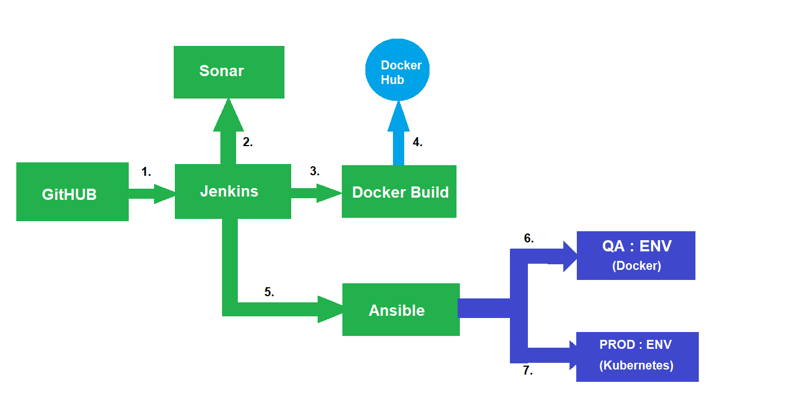

# SpringPetclinic CI/CD
## - By Nirakh Rastogi

Pipeline Steps:
----------------
1. Jenkins pull Source Code from GitHUB.
2. Jenkins will trigger Sonar Analysis.
3/4. Jenkins will trigger docker build and push image to docker hub.
5. Jenkins will Trigger Ansible.
6. Ansible will trigger a task on host QA. It will pull the docker image and run the docker container.
7. Ansible will trigger a task on host PROD. This task will trigger a kubernetes deployment on PROD.

Jenkinsfile
------------
Stages-
-   `Git - Checkout` : Pulls source code from GitHub
-   `Build` : Jenkins will run `mvn clean install` command to build the source code.
-   `SonarQube analysis` : It will run sonar qube analysis.
-   `Build and Push Spring Petclinic Docker Image` : It will build the docker image with the help of `Dockerfile` present in Repo and push it to docker registry.
-   `Transfer ansible playbook` : Transfer the ansible playbook `spring-pet-playbook.yaml` to ansible machine.
-   `Run ansible playbook` :  Triggers the ansible playbook.

Dockerfile
-----------
- To Build Image Run,

  `sudo docker build --build-arg <jar_file_path> -t <imagename>:<tag> .`

- To Push image,

  `sudo docker push <imagename>:<tag>`

- To Pull Image,

  `sudo docker pull <imagename>:<tag>`

- To run the conatiner,

  `sudo docker run -d --name <container_name> -p <host_port>:8080 <image_name>:<tag>`

spring-pet-playbook.yaml
-------------------------
It consist of two host,
1. QA
2. PROD

In QA, it will deploy using docker.
It will pull the image, remove the old container and start the new container.

In PROD, it will deploy using kubernetes.
I am using 1 master and 2 nodes config.
It will deploy start 3 container pods.

## Check screenshots of jenkins build in ScreenShots folder.
